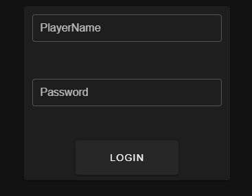
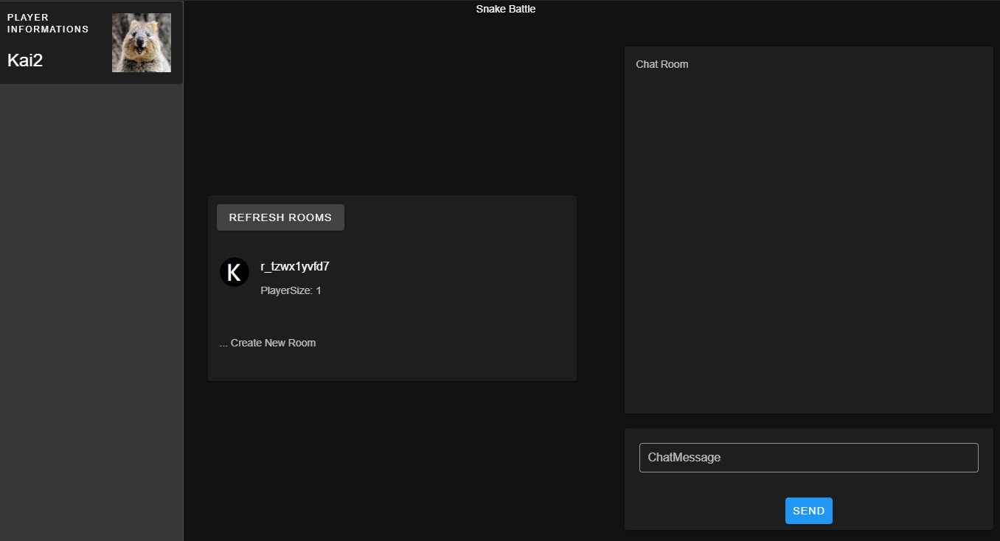
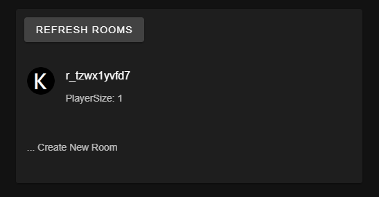
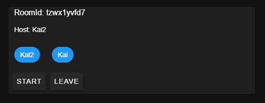
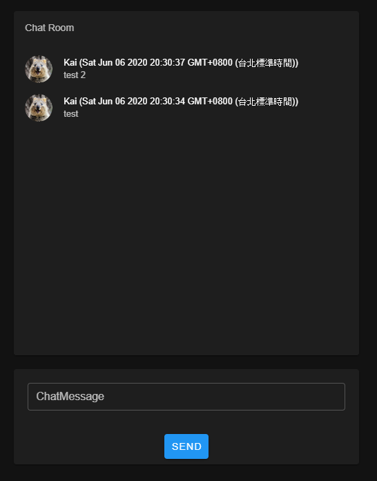

# SnakeBattle

這是一個練習使用nodejs、express、express-ws、vuejs與vuetify相關的專案  
想做一個多人對戰的貪食蛇遊戲

## Update

2020/06/06 完成進出遊戲房邏輯，基本的介面排版

---

## 安裝

此專案需要在運行系統先安裝nodeJs、mongoDB

### 最新插件版本安裝：
在專案目錄下執行下列指令  
1. `npm install express --save` 安裝express
2. `npm install express-ws --save` 安裝express-ws套件(websocket)
3. `npm install mongoose` 安裝mongoose套件
3. `npm install js-md5` 安裝md5套件

### 直接使用我的版本安裝(建議)
在專案目錄下執行下列指令  

    `npm install`

---

## 執行
1. `node main.js` 執行server
2. 打開瀏覽器瀏覽 `localhost:3000` 就可以看到遊戲畫面

---

## TODOs

1. 貪食蛇遊戲主邏輯與介面
2. 頭像選擇或上傳功能
3. 更多的遊戲模式與積分榜

---

## Features
  
登入畫面  

  
排版展示  

  
遊戲房列表  

  
遊戲房

  
聊天室  